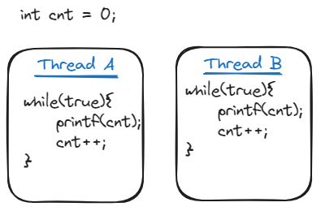

# Interview Questions Bangladesh

A crowd sourced collection of interview questions asked in Bangladeshi Tech companies. 

## Table of Contents
- [Chaldal](#chaldal)
- [DSI](#dsi)
- [IQVIA](#iqvia)
- [Priyo](#priyo)
- [Samsung (SRBD)](#srbd)
- [Synesis IT](#synesis-it)
- [Therap](#therap)


## Chaldal

### Intro
Chaldal interview process has 3 stage

1. Apltitude Test: Basic reasoning, vocabulary, maths etc
2. First round Interview :  There will be 2 seperate interview. The questions asked depend on the interviewer. They may be coding or technical or both. Two yes will lead to next round. 1 yes and 1 no gives you a third chance.
3. CTO round: It is kind of a behavioural round. But the questions can be coding or technical.

### Questions

<details>
<summary>
Tell me about yourself? Why do you want to join chaldal
</summary>
<br>
Answer varies from person to person
</b>
</details>

<details>
<summary>
You have been provided a spiral matrix of size NXN along with a coordinate (x, y) as follows. Find the element at the position (x, y) of the matrix.
N = 4, x = 2, y =1 

```math
$$\begin{bmatrix}
1 & 2 & 3 & 4 \\
12 & 13 & 14 & 5 \\
11 & 16 & 15 & 6 \\
10 & 9 & 8 & 7
\end{bmatrix}$$
```
</summary>
<br>

```C++
The element at position (2, 1) is **12** [*indexed at (1, 0)*]
```
<br>
</details>

<details>
<summary>
Given a number in roman format. Convert it to arabic numeral.
</summary>
<br>

```C++

map<char,int>RtoA;
void preprocess(){
    // Map of romans to Arabic
    RtoA['I'] = 1;      RtoA['V'] = 5;
    RtoA['X'] = 10;     RtoA['L'] = 50;
    RtoA['C'] = 100;    RtoA['D'] = 500;
    RtoA['M'] = 1000;
}

// Roman numerals to Arabic
int RomanToArabic(string R){
    int value = 0;
    int n = R.size();
    for(int i=0;i<n;i++){
        if( R[i+1] && RtoA[ R[i] ] < RtoA[ R[i+1] ] ){
            value+= RtoA[ R[i+1] ] - RtoA[ R[i] ];
            i++;
        } else{
            value+=RtoA[ R[i] ];
        }
    }
    return value;
}
```

<br>
</details>


<details>
<summary>
Given a string of characters. Reverse the string without using any library function.
</summary>
<br>
[Answer]
<br>
</details>


<details>
<summary>
Given a string of characters. Check if the given string is a palindrome.
</summary>
<br>
[Answer]
<br>
</details>

<details>
<summary>
Given an positive integer n. Find the sum of even fibonacchi number upto nth term.
</summary>
<br>
[Answer]
<br>
</details>

<details>
<summary>
Given a string of characters [0-9]. Convert it to integer.
</summary>
<br>
[Answer]
<br>
</details>

<details>
<summary>
Given an array of integers. Generate all possible permutation of the given array.
</summary>
<br>
[Answer]
<br>
</details>

<details>
<summary>
Given an array of integers. Generate all possible subset of the given array.
</summary>
<br>
[Answer]
<br>
</details>

<details>
<summary>
Given a regex expression and a string. Check if the regex expression matches with the string.
</summary>
<br>
[Answer]
<br>
</details>

<details>
<summary>
Each student is assigned to an assignment at a particular location at a specific time. Are there any inconsistencies in the assignments ? Find at least one of them by looking into the input. Then write a code to print all inconsistencies in the assignments. 
</summary>

<br>

```C++

/*
class Assignment {
	String Area
	String Time
	List<Integer> StudentIds
}

getInput() {
	return
    	[
        	Assignment { Area = "Garden", 	Time = "A", StudentIds = [2,9,1] }
        	Assignment { Area = "Pond",   	Time = "M", StudentIds = [2,8,5] }
        	Assignment { Area = "FoodCourt",  Time = "A", StudentIds = [4,8,7] }
        	Assignment { Area = "Playground", Time = "M", StudentIds = [1,7,2] }
        	Assignment { Area = "PicnicArea", Time = "M", StudentIds = [7,3,9] }
        	Assignment { Area = "Zoo",    	Time = "A", StudentIds = [6,3,2] }
    	]
}

main() {
	assignments = getInput()
    
	// Do something with the assignments list here ...
}
*/
// Solution :

#include <bits/stdc++.h>

using namespace std;


struct Assignment {
    string Area, Time;
    vector<int> StudentIds;
};

vector<Assignment> getInput() {
    vector<Assignment> res = {
        {"Garden", "A", {2, 9, 1}},
        {"Pond", "M", {2, 8, 5}},
        {"FoodCourt", "A", {4, 8, 7}},
        {"Playground", "M", {1, 7, 2}},
        {"PicnicArea", "M", {7, 3, 9}},
        {"Zoo", "A", {6, 3, 2}},
    };
    return res;
}

int main() {
    vector<Assignment> inputs = getInput();

    map< pair<int, string>, vector<string> > mapping;
    for (Assignment a : inputs) {
        for (auto studentId : a.StudentIds)
            mapping[{studentId, a.Time}].push_back(a.Area);
    }

    for (auto k: mapping) {
        if (k.second.size() > 1) {
            cout << "Student " << k.first.first << " has conflicts at time " << k.first.second << " at : " << endl;

            for (string area : k.second) {
                cout << area << " ";
            } 
            cout << endl;
        }
    }
}

```
    
<br>
</details>

<details>
<summary>
Implement Game of Life
</summary>

<br>

```C++

/*
	__________________
|██                                	 
|   ██ ██                           	 
|██ ██ 
|
|
|
|
|

In the game of life, you have a 2D matrix of small squares that can be either alive or dead. The matrix goes through iterations, and on every iteration the squares can die or be revived. This is based on the previous iteration and the below rules
A living square with 1 or less neighbors in the previous iteration will die, as if from loneliness
A living square with 2 or 3 neighbors in the previous iteration will survive, as if from contentment
A living square with 4 or more neighbors in the previous iteration will die, as if from overpopulation
A dead square with exactly 3 neighbors in the previous iteration will be revived, as if by unfulfilled desires
Implement a square matrix of size 20 and set up the initial five (given) living squares. Then run 10 iterations on it, then print the final matrix. 0,0 should be the top left of the matrix, where the first is the row and the second is the column.
matrix size = 20
iterations = 10
initial squares =
[0][0]
[1][1]

*/

// Solution

#include <bits/stdc++.h>

#define pb             push_back
#define int            long long
#define endl "\n" 
#define fill(x, y)     memset(x, y, sizeof(x))
#define all(x)         (x).begin(), (x).end()
#define debug(x)       { cerr << #x << " = " << x << endl; }
#define IO	       { ios_base::sync_with_stdio(false); cin.tie(0); }
#define read(x)	       freopen(x, "r", stdin)
#define write(x)       freopen(x, "w", stdout)

using namespace std;

typedef long long      ll;
typedef pair<int, int> ii;
typedef vector<int>    vi;

const int msz = 20;
const int max_iters = 10;
vector<vector<bool>> matrix(msz, vector<bool>(msz, false));

vector<int> dx = {-1, -1, -1, 0, 0, 1, 1, 1};
vector<int> dy = {-1, 0, 1, -1, 1, -1, 0, 1};


signed main() {
    matrix[0][0] = true;
    matrix[1][1] = true;
    matrix[1][2] = true;
    matrix[2][0] = true;
    matrix[2][1] = true;

    for (int gen = 1; gen <= max_iters; gen++) {
        vector<vector<bool>> next_gen_mat(msz, vector<bool>(msz, false));

        for (int i=0; i<msz; i++) {
            for (int j=0; j<msz; j++) {
                int alive_neighbors = 0;

                for (int k=0; k<8; k++)  {
                    int ni = i + dx[k], nj = j + dy[k];
                    if (ni >= 0 and ni < msz and nj >=0 and nj < msz) {
                        if (matrix[ni][nj]) alive_neighbors++;
                    }
                }

                if (matrix[i][j]) {
                    if (alive_neighbors <= 1) next_gen_mat[i][j] = false;
                    else if (alive_neighbors <= 3) next_gen_mat[i][j] = true;
                    else next_gen_mat[i][j] = false;
                } else {
                    if (alive_neighbors == 3) next_gen_mat[i][j] = true;
                }

            }
        }

        matrix = next_gen_mat;

        cout << "Gen : " << gen << endl;
        for (int i=0; i<msz; i++) {
            for (int j=0; j<msz; j++) {
                if (matrix[i][j]) cout << "██";
                else cout << "  ";
            }
            cout << endl;
        }
        cout << endl;

    }
}


```
    
<br>
</details>


<details>
<summary>
Find digits from a string( Leading zeroes doesn't get counted)
</summary>
<br>

```
```

</b>
</details>

<details>
<summary>
Given a string s containing lowercase lattin letters and another string p containing lowercase lattin letters and * and ?. * means any substring possibly empty. ? means any character but single.

Print yes or no if both strings matches. [RegEx Matching]
</summary>
<br>

```
```

</b>
</details>

<details>
<summary>
About project: What have you done in the authentication part in your project? Also how did you specify roles for different users.
</summary>
<br>

```
```

</b>
</details>

<details>
<summary>
Write a function which converts decimal number to hexadecimal
</summary>
<br>

```C++
string decimalToHexa(int decimal){
    string hexa = "";
    while(decimal > 0){
        int remainder = decimal % 16;
        if(remainder < 10){
            hexa = to_string(remainder) + hexa;
        }else{
            hexa = char(remainder + 55) + hexa;
        }
        decimal /= 16;
    }
    return hexa;
}
```

</b>
</details>

<details>
<summary>
Write a function which finds all the subset of a given set.
</summary>
<br>

```
```

</b>
</details>

<details>
<summary>
Given a set of orderings of letters, determine their topological sorting order. The orderings are provided as strings. 
For example, given the input ["A>B", "B>C", "C>D"], the expected output is "ABCD".
</summary>
<br>
[Answer]
<br>
</details>

<details>
<summary>
Given two numbers represented as arrays of characters in decimal format, add them and return the result in the same format.
For example, Input: ['1', '2', '3'] and ['4', '5', '6']
Output: Output: ['5', '7', '9']
</summary>
<br>
[Answer]
<br>
</details>


## DSI

### Intro
DSI takes a on campus written test first. The questions contain some coding problem, Database, writting sql, OOP etc
The second stage is face to face interview

### Questions
<details>
<summary>
There is an array initially containing n numbers. then each of the numbers of the array is multiplied by 2. Now the array is 2 * n size and each element of the array gets shuffled. You are given the shuffled array of size 2 * n. You have to restore the original array.
</summary>
<br>

```C++
bool restoreDouble(vector<int> input,vector<int>& output){
    int n = input.size();
    map<int,int> marked;
    sort(input.begin(),input.end());
    for(int i=0;i<n;i++){
        if( marked[ input[i] ] == 0 ) {
            output.push_back( input[i] );
            marked[ 2*input[i] ] ++;
        }else{
            marked[ input[i] ]--;
        }
    }
    for( auto entry:marked ){
        if( entry.second != 0 ) return false;
    }
    return true;
}
```
<br/>
</details>

<details>
<summary>
Given n inputs each with n bits. Output a number not given which has n bits too.
</summary>
<br>
[Answer]
<br>
</details>


## IQVIA

### Intro
The preliminary test of IQVIA consists of 3 stage

- Aplitude: Understanding, Vocabulary, Reasoning, Maths
- Automata: Easy level coding test
- Automata Pro: Medium level coding test

Then if selected there will be a technical interview. 

### Questions

<details>
<summary>
Given a string of lowercase characters. Find the count of characters which only occured once in the string.
</summary>
<br>
[Answer]
<br>
</details>

<details>
<summary>
Given n,Find all primes less than equal n.
</summary>
<br>
[Answer]
<br>
</details>

<details>
<summary>
Given coordinates x,y and radius r of two circle. Find the area of intersection between them. Print area in double with 6 digit precision.
</summary>
<br>
[Answer]
<br>
</details>

<details>
<summary>
Given a list of ranges. Find the length covered by at least one of the range. <br>
input: [[1,3],[2,5],[6,7]] <br>
output: 5 <br>
explanation: range [1,5],[6,7] are covered by at least one range
</summary>
<br>
[Answer]
<br>
</details>

<details>
<summary>
Sort array elements by their frequency and in case of tie, keep the order they arrive in the original array.
</summary>
<br>
[Answer]
<br>
</details>

<details>
<summary>
Given the connection between cities, Count the number of disjoint clusters of cities.
</summary>
<br>
[Answer]
<br>
</details>

<details>
<summary>
Given a string of characters S and a specific character C. Find the number of occurance of C in S.
</summary>
<br>
[Answer]
<br>
</details>

<details>
<summary>
Given a range [l,r]. Find all primes between this range. 
</summary>
<br>
[Answer]
<br>
</details>

<details>
<summary>
Given two binary string A,B. Find the minimum number of bit flips to change string A to string B.
</summary>
<br>
[Answer]
<br>
</details>

<details>
<summary>
2 shops sell apples in lots. their price is given. You cannot buy any loose apples. find minimum cost of buying exactly n apples.
</summary>
<br>
[Answer]
<br>
</details>

<details>
<summary>
Given an integer array. Sort the array in nondecreasing order using frequency count of elements in the array. 
</summary>
<br>
[Answer]
<br>
</details>

<details>
<summary>
Given an array of thresholds. For each threshold print the first negative number.
</summary>
<br>
[Answer]
<br>
</details>

<details>
<summary>
What happens when you type google.com and press enter in your search bar
</summary>
<br>
[Answer]
<br/>
</details>

<details>
<summary>
Given a string s containing just the characters '(', ')', '{', '}', '[' and ']', determine if the input string is valid.
</summary>
<br>
https://leetcode.com/problems/valid-parentheses/
<br/>
</details>

<details>
<summary>
You are a professional robber planning to rob houses along a street. Each house has a certain amount of money stashed, the only constraint stopping you from robbing each of them is that adjacent houses have security systems connected and it will automatically contact the police if two adjacent houses were broken into on the same night.
Given an integer array nums representing the amount of money of each house, return the maximum amount of money you can rob tonight without alerting the police
</summary>
<br/>
https://leetcode.com/problems/house-robber/
<br/>
</details>

<details>
<summary>
Input given is an int array, which may or may not contain positive, negative or zero values. Write a program to find out the two numbers which gives the highest product. 
</summary>
<br/>
https://www.geeksforgeeks.org/return-a-pair-with-maximum-product-in-array-of-integers/
<br/>
</details>

<details>
<summary>
Given an array having 0 to n-1 unsorted. Return a new array having their indices 
</summary>
<br/>
[Answer]
<br/>
</details>

<details>
<summary>
Given two strings, find the number of times the second string occurs in the first string, whether continuous or discontinuous. 
</summary>
<br/>
https://www.geeksforgeeks.org/find-number-times-string-occurs-given-string/
<br/>
</details>

<details>
<summary>
Given an array of positive integers. We need to make the given array a ‘Palindrome’. The only allowed operation is”merging” (of two adjacent elements). Merging two adjacent elements means replacing them with their sum. The task is to find the array of maximum length with the minimum number of merge operations required to make the given array a ‘Palindrome’. 
</summary>
<br/>
https://www.geeksforgeeks.org/find-minimum-number-of-merge-operations-to-make-an-array-palindrome/
<br/>
</details>

## Priyo

### Intro
Priyo takes 2 interview. \
First one has two part. One coding round and another technical round. Each half hour long. \
Second one is with CEO. It is a behavioural round. 

### Questions
<details>
<summary>
Given an array of positive integers and a integer p. Find the length of the minimum subarray upon deleting which the sum of remaining element will be divisible by p;

Follow up 1: find the number of subarray (need not be minimum) deleting which will result the sum to be divisible by p

Follow up 2: For each index find the number of times it is included in any subarray upon deleting which the remaining sum will be divisible by p
</summary>
<br>
[Answer]
<br/>
</details>

<details>
<summary>
You are given an array people and an integer limit, where people[i] is the weight of the ith person, and an infinite number of boats where each boat can carry a maximum weight of limit. 
Each boat carries at most two people at the same time, provided the sum of the weight of those people is at most limit.

Return the minimum number of boats to carry every given person.
</summary>
<br>
[Answer]
<br/>
</details>

<details>
<summary>
Given an array of n colored balls. And some boxes. Each box has some capacity and each box must contain balls of same color. What is the maximum number of balls that the boxes can carry?
Constraint: max capacity of box - min capacity of box <= 1
</summary>
<br>
[Answer]
<br/>
</details>


<details>
<summary>
Given an array of n integers.Find max subarray sum with at most one delete.
</summary>
<br>
[Answer]
<br/>
</details>

<details>
<summary>
Given an array of n integers. Find the number of subarrays where the maximum element is between x and y
</summary>
<br>
[Answer]
<br/>
</details>


## SRBD
### Intro

SRBD takes interview in two round.

Round 1 is coding round. The problems are typically from leetcode. You can only proceed to round 2 if you can solve round 1 correctly.

Round 2 is a technical round. You might get asked about basic theories or solve some simple problems

### Questions

<details>
<summary>
You are given n balloons, indexed from 0 to n - 1. Each balloon is painted with a number on it represented by an array nums. You are asked to burst all the balloons.

If you burst the ith balloon, you will get nums[i - 1] * nums[i] * nums[i + 1] coins. If i - 1 or i + 1 goes out of bounds of the array, then treat it as if there is a balloon with a 1 painted on it.

Return the maximum coins you can collect by bursting the balloons wisely.

Variants: coins achived is nums[i-1]*nums[i+1]
</summary>
<br>
[Answer]
<br>
</details>

<details>
<summary>
Mr. Kim has to deliver refrigerators to N customers. From the office, he is going to visit all the customers and then return to his home. 
Each location of the office, his home, and the customers is given in the form of integer coordinates (x,y) (0≤x≤100, 0≤y≤100) . 
The distance between two arbitrary locations (x1, y1) and (x2, y2) is computed by |x1-x2| + |y1-y2|, where |x| denotes the absolute value 
of x; for instance, |3|=|-3|=3. The locations of the office, his home, and the customers are all distinct. You should plan an optimal way 
to visit all the N customers and return to his among all the possibilities.
You are given the locations of the office, Mr. Kim’s home, and the customers; the number of the customers is in the range of 5 to 10. 
Write a program that, starting at the office, finds a (the) shortest path visiting all the customers and returning to his home. 
Your program only have to report the distance of a (the) shortest path.
</summary>
</details>

<details>
<summary>
You are given a directed graph represented by an adjacency list. Your task is to detect if there exists a cycle in the graph.
If a cycle is found, print the nodes of the cycle in sorted order. Additionally, provide the results for each test case in the format 
"#testCaseNo node1 node2 ... nodeK". If no cycle is present, print 0.
</summary>
<br>

```C++
#include<bits/stdc++.h>
using namespace std;
int firstNodeOfTheCycle, lastNodeOfTheCycle;
bool detectCycle(int node, vector<vector<int>>& adjList, vector<bool> &visited, vector<bool> &dfsVisited, vector<int> &parent){
    visited[node] = true;
    dfsVisited[node] = true;

    for(auto neighbour : adjList[node]){
        if(!visited[neighbour]){
            parent[neighbour] = node;
            bool isCycleDetected = detectCycle(node, adjList, visited, dfsVisited, parent);
            if(isCycleDetected){
                firstNodeOfTheCycle = neighbour, lastNodeOfTheCycle = node;
                return true;
            }
        }
    }

    dfsVisited[node] = false;
    return false;
}

void calculateCycle(vector<int>& ans, vector<int>& parent){
    int curNode = lastNodeOfTheCycle;
    while(curNode != firstNodeOfTheCycle){
        ans.push_back(curNode);
        curNode = parent[curNode];
    }
    ans.push_back(curNode);
}
int main(){
    int tc = 10;
    for(int t = 1; t < tc; t++){
        int n,m;
        bool wasVisited = false;
        cin >> n >> m;
        vector<vector<int>>& adjList(n + 1);
        vector<bool> visited(n + 1, false), dfsVisited(n + 1, false);
        vector<int> parent(n + 1, -1), ans;
        for(int i = 0; i < m; i++){
            int u, v;
            cin >> u >> v;
            adjList[u].push_back(v);
        }
        for(int i = 1; i <= n; i++){
            if(!visited[i]){
                bool isCycleDetected = detectCycle(i, adjList, visited, dfsVisited, parent);
                if(isCycleDetected){
                    wasVisited = true;
                    calculateCycle(ans, parent);
                    sort(ans.begin(), ans.end());
                    cout<<"#"<<t;
                    for(auto it: ans){
                        cout<<" "<<it;
                    }
                    cout<<endl;
                    break;
                }
            }
        }
        if(!wasVisited){
            cout<<"#"<<t<<" "<<endl;
        }
    }
}
```
<br/>
</details>


<details>
<summary>
Given 5 element. We want to search million time that will return is searched element is present or no. What is the best time complexity.
</summary>
<br>
[Answer]
To sort  $nlon(n)$. The for each time search $log(n)$.
<br/>
</details>

<details>
<summary>
Follow up question. We are guaranteed that each time new search element would be front the next position of previous search. Write code on pen & paper.
</summary>
<br>
[Answer]

```C++
int lastElementPosition = 0;
int solve( vector<int> arr, int element){
	int l =  lastElementPosition , r = 0;
	while( l <= r){
		int mid = l + (r - l) / 2;
        if( arr[mid] == element ){
            lastElementPosition = mid;
            return mid;
        }
        else if( element < arr[mid] ){
            r = mid - 1;
        }else{
            lastElementPosition = l;
            l = mid + 1;
        }
    }
}
```

<br/>
</details>

<details>
<summary>
Follow up question. Suppose we have 5000 number each 500 digit. Now how will you search? 
</summary>
<br>
[Answer]
Trie Data structure
<br/>
</details>

<details>
<summary>
You have string with repeated character. Example : `abcaade`. You can’t use array or map. 
</summary>
<br>
[Answer 1]
My approach : Sort & search concurrent character `nlog(n)`.
[Answer 2]
Optimize approach : An integer have 32 bit. We have 26 small letter character.  We just need to allocate each bit for position of a character. If an element is present set the concurrent bit.  & finally count.
<br/>
</details>


<details>
<summary>
Thread A and Thread B are running parallely. What will be the output of following code? 
</summary>
<br>
[Answer]
Unpredictable. It is not guaranteed that which thread is currently accessing the `cnt` variable. Was asked a follow up question on how to solve this issue?

<br/>
</details>

## Synesis IT
Synesis takes a on campus written test first. The questions contain some coding problem, Database, writting sql, OOP etc
The second stage is face to face interview
<details>
<summary>
How would you manage your team if some teammate doesn't cooperate or doesn't contribute?
</summary>
<br>
Answer varies from person to person
<br/>
</details>

## Therap
### Intro
Therap has multiple roles. 
1. Software Engineer
2. Database Engineer
3. Quality Assurance Engineer
4. Embedded System Engineer

The selection process has x number of steps
1. Initial screening
2. ?
### Questions
<details>
<summary>
[DB] Design an ERD of online restaurant management system
</summary>
<br>
[Answer]
<br/>
</details>

<details>
<summary>
[DB] What is Database Transaction
</summary>
<br>
[Answer]
<br/>
</details>

<details>
<summary>
[DB] Briefly explain ACID properties
</summary>
<br>
[Answer]
<br/>
</details>

<details>
<summary>
[DB] What is normalization and denormalization
</summary>
<br>
[Answer] 
<br/>
</details>

<details>
<summary>
[DB] Briefly explain BCNF
</summary>
<br>
[Answer]
<br/>
</details>

<details>
<summary>
[DB] Explain data warehousing
</summary>
<br>
[Answer]
<br/>
</details>

<details>
<summary>
[DB] Explain data redundancy
</summary>
<br>
[Answer]
<br/>
</details>

<details>
<summary>
[DB] Briefly mention the differences between stored procedure, function and trigger
</summary>
<br>
[Answer]
<br/>
</details>

<details>
<summary>
[DB] Briefly mention the differences between delete, drop and truncate
</summary>
<br>
[Answer]
<br/>
</details>

<details>
<summary>
[DB] Briefly mention the differences between where and having clause
</summary>
<br>
[Answer]
<br/>
</details>

<details>
<summary>
[DB] Briefly mention the differences between candidate key and super key
</summary>
<br>
[Answer]
<br/>
</details>

<details>
<summary>
[DB] A schema has entities like CUSTOMERS, ORDERS, ORDER_ITEMS, PRODUCTS, PRODUCT_DETAILS, WAREHOUSES, INVENTORIES. Data fields of entities and cardinality relationships were given in the figure. Questions included from <>
1. Group by, Order by, Join <>
2. Extracting month and year from oracle dates <>
3. Find ranks based on some criterion. The extremely hard question was - find top 10 customers based on their total amount spent in 2023. This one involved the following topics: aggregation, join of multiple tables, nested sub-query, year extraction from date. The book of Sukarna sir contains one/two such exercises. Practise them properly

</summary>
<br>
[Answer]
<br/>
</details>

<details>
<summary>
[SWE] Given an array of numbers indicating stock price of n consecutive days. If you buy stock at one day and sell at any later day what is the maximum profit that you can get
</summary>
<br>
[Answer]
<br/>
</details>

<details>
<summary>
[SWE] Given an array of n integers. You need to take all zeroes in array to the end without changing the relative order of remaining element.
eg: [2,0,0,3,1,0,5] => [2,3,1,5,0,0,0]
</summary>
<br>
[Answer]
<br/>
</details>

<details>
<summary>
[SWE] Given an array of n integers. Reorder the elements such that all odd numbers occur after even numbers.
</summary>
<br>
[Answer]
<br/>
</details>

<details>
<summary>
[SWE] Given an array of strings. Print the sets of strings which are anagram.
eg: ["cat","tab","act","bat","taco"] => [{"cat","act"},{"tab","bat"},{"taco"}] 
</summary>
<br>
[Answer]
<br/>
</details>

<details>
<summary>
[SWE] Given an array of n integers. Find the kth largest element in the array.
</summary>
<br>
[Answer]
<br/>
</details>

<details>
<summary>
[SWE] Given two very large number in string format. Find the sum of the two number
</summary>
<br>
[Answer]
<br/>
</details>

<details>
<summary>
[SWE] Given two binary tree. Check if they are identical [not isomorphism]
</summary>
<br>
[Answer]
<br/>
</details>

<details>
<summary>
[SWE] Given two array of integers. Find the common elements between them.
</summary>
<br>
[Answer]
<br/>
</details>

## Contributing
See CONTRIBUTION.md for more guidelines
