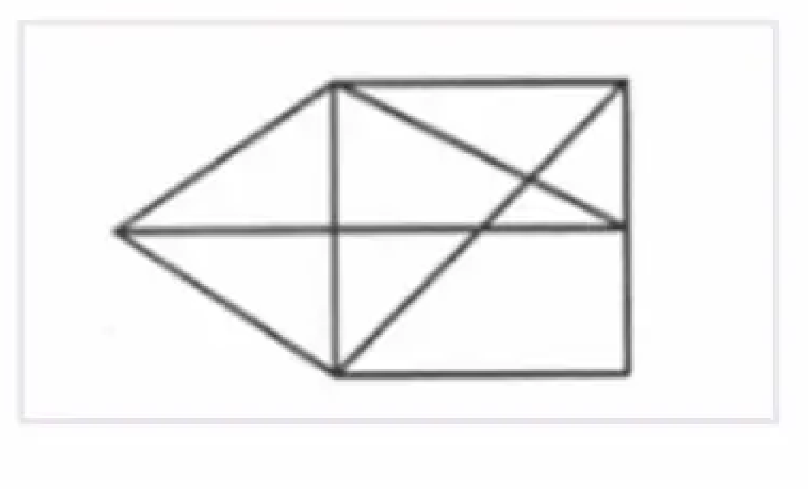

# Brain Station 23

|  |  |
| :-| :- |
| Founding year | 2006 |
| Company Website | http://www.brainstation-23.com/ |
| Career Website | https://erp.bs-23.com/jobs |
| Technologies Used| Android, IOS, React, React-Native, Odoo, Xamarin, .Net, PHP, Python, Java, AEM, Sitecore, Flutter |

## Introduction

Brain Station 23 is at the forefront of global digital transformation, delivering state-of-the-art technology solutions designed to propel businesses into the future. With expertise spanning software development, cloud computing, enterprise-grade mobile applications, AI and machine learning, and blockchain technology, they offer bespoke solutions that drive innovation and efficiency.

## Star Coder Interview Stages

Star Coder is an annual recruitment test for BS23. The program has 5 stages

1. **Online MCQ Exam:** Everyone who applies for the program will be given the opportunity to sit for this round.  Questions are asked from computer science subjects. The topics generally cover programming, data-algo, OOP, databases, etc. Those who do well in this exam are shortlisted for the next step. 

1. **Onsite Exam:** This round is onsite, a 2-3 hour written exam. Candidates have to take an online exam on problem solving, data algorithms, databases, etc. No internet access is given for this stage. 

1. **Day long Assessment Test:** This is an interesting round. There are various events throughout the day. Teamwork, idea generation, fun, etc. It is a lot like a hackathon. Presentations have to be given. It takes place in their office from morning to evening. Candidates are given a scenario and some questions. They have to come up with a solution and present it. The submissions are ERD, wireframe, SQL etc. 

1. **Technical Interview:** Candidates may be interviewed about the project they developed in Step 3. They may also be asked about problem solving and computer science fundamentals

1. **HR Interview**

1. **Client Facing Interview:** Sometimes candidates are tasked to conduct a real client facing interview. This stage is not applicable for everyone and only given occasionally.

> The information presented here is collected from the LinkedIn post of Abdullah Al Hasan vaiya (with his permission, of course).


## Online MCQ Round
The problems presented in this round are fairly basic. The format is multiple choice. 

Topics Covered are:
- Object-Oriented Programming (OOP)
- Database
- Data Structure & Algorithm
- Problem-Solving
- Output Tracing
- Analytical Ability
- Software Development Life Cycle (SDLC)

> The questions provided here are collected from various online platforms such as Facebook and Glassdoor. No individual candidate has disclosed the questions verbatim. 
<article>

Mr. Joy is planning to build a web browser. Now he is analyzing requirements for the navigation system of his web browser, which will preserve the browsing history. What is the appropriate data structure to use for the navigation system?
<details><summary>Show Answer</summary>

The appropriate data structure to use for the navigation system of a web browser is a `Stack`. A stack follows the Last In First Out (LIFO) principle, which is suitable for maintaining the browsing history.
</details>
</article>

<article>

In the following code snippet, what does the keyword 'this' refer to

```java
class Employee {
    private String name;
        public Employee(String name) {
        this.name = name;
    }
}  
```
<details><summary>Show Answer</summary>

The keyword 'this' refers to the current instance of the class. In this context, 'this.name' refers to the instance variable 'name' of the current Employee object.
</details>
</article>

<article>

In a bag , there is black and red balls. The ratio of black to red is 3:7 , if we add 20 more black balls to the bag then the ratio becomes 1:2. How many red balls are there?
<details><summary>Show Answer</summary>

Let the number of black balls be 3x and the number of red balls be 7x. After adding 20 more black balls, the ratio becomes 1:2. So, the number of black balls is 3x + 20 and the number of red balls is 7x. According to the given condition, (3x + 20) / 7x = 1 / 2. Solving this equation, we get x = 40. Therefore, the number of red balls is 7x = 280.
</details>
</article>

<article>

which of the following is false about RDBMS (Relational Database Management System)?

- RDBMS supports concurrency control to handle multiple transactions simultaneously.
- RDBMS uses tables to store data in rows and columns.
- In RDBMS, a unique constraint prevents null values in a column.
- RDBMS ensures data integrity using ACID properties.
<details><summary>Show Answer</summary>

The false statement about RDBMS is: `In RDBMS, a unique constraint prevents null values in a column.` A unique constraint ensures that all values in a column are unique, but it does not prevent null values.
</details>
</article>

<article>

A train leaves station A at 7 AM with the speed of 60 kmph, and another train leaves the A station at 8 AM with the speed of 90 kmph..when will the second train catch the first train?
<details><summery>Show Answer</summery>

The first train is already 60 km ahead and the second train is faster, so we calculate the relative speed:
Relative Speed = Speed of Second Train − Speed of First Train = 90km/h − 60km/h = 30km/h
Time = Distance / Relative Speed = 60km / 30km/h ​= 2hours
Final answer = 8:00AM + 2hours = 10:00AM
The second train will catch the first train at 10 AM
</details>
</article>

<article>

What will be the output of the following code?

```cpp
#include <stdio.h>
int main() {
    int sum = 7 + 6 / 3 + 14 * 2;
    printf("%d", sum);
    return 0;
}
```
<details><summary>Show Answer</summary>

Division and multiplication have higher precedence than addition. So, the expression will be evaluated as `7 + 2 + 28 = 37`
</details>
</article>

<article>

If the area of a rectangular region is equal to the area of a square, then the perimeter of the rectangular must be
</article>

<article>

In the context of the Software Development Life Cycle (SDLC), which model emphasizes the continuous iteration of the development and testing phases throughout the project, accommodating changes in requirements even late in the development process?
<details><summary>Show Answer</summary>

The correct answer is Agile Model. The Agile methodology is a project management approach that involves breaking the project into phases and emphasizes continuous collaboration and improvement. Teams follow a cycle of planning, executing, and evaluating.
</details>
</article>

<article>

Who is most likely to write unit tests in a software development project?
<details><summary>Show Answer</summary>

Developers are responsible for writing unit tests to ensure that individual units of code are functioning correctly. Unit tests are typically written to test the functionality of the code.
</details>
</article>

<article>  

Once upon a time, a group of detectives were presented with a challenge to identify which of the 1000 candies was poisoned before it caused harm to any living species. They had to act fast, as the poison would take effect within an hour of consumption. The detectives knew they could use test subjects, but they needed to determine the minimum number required to solve the mystery in time. Can you help them find the solution before it's too late?
</article>  

<article>  

In the Agile Model, what is the primary purpose of a "sprint"? 
<details><summary>Show Answer</summary>

In Agile methodology, a "sprint" is a short, time-boxed period where a team focuses on completing a specific set of work, essentially a dedicated cycle within a project where a defined amount of functionality is developed and ready for review.
</details>
</article>  

<article>  

What does the `static` keyword mean when used with a method?  
<details><summary>Show Answer</summary>

When the `static` keyword is used with a method, it means that the method belongs to the class itself rather than an instance of the class. Static methods can be called without creating an instance of the class.  
When we declare a field static, exactly a single copy of that field is created and shared among all instances of that class. Similar to static fields, static methods also belong to a class instead of an object. So, we can invoke them without instantiating the class.
</details>
</article>  

<article>  

Why are immutable objects often preferred in OOP design?
<details><summary>Show Answer</summary>

Immutable objects are often preferred in OOP design because they are thread-safe, meaning they can be shared between multiple threads without the risk of data corruption. Additionally, immutable objects are easier to reason about and can help prevent bugs related to mutable state changes.
</details>
</article>  

<article>  

You are given an undirected graph with weighted edges. Which algorithm would you use to find the Minimum Spanning Tree (MST)?  
<details><summary>Show Answer</summary>

We can use Kruskal's algorithm or Prim's algorithm to find the Minimum Spanning Tree (MST) of an undirected graph with weighted edges.
</details>
</article>  

<article>  

What is the time complexity of searching for an element in a balanced binary search tree?  
<details><summary>Show Answer</summary>

The time complexity of searching for an element in a balanced binary search tree is `O(log n)`, where `n` is the number of nodes in the tree.
</details>
</article>  

<article>  

There are 100 light bulbs and 100 people. Initially, all bulbs are off. Person 1 flips every bulb `(1, 2, 3, 4, …)`. Person 2 flips every 2nd bulb `(2, 4, 6, …)`. Person 3 flips every 3rd bulb `(3, 6, 9, …)`, and so on, until all 100 people have acted. How many people would have flipped bulb number 72?
<details><summary>Show Answer</summary>

We need to find the factors of 72 to determine how many people would have flipped bulb number 72. The factors of 72 are `1, 2, 3, 4, 6, 8, 9, 12, 18, 24, 36, 72`. Therefore, 12 people would have flipped bulb number 72.
</details>
</article>  

<article>  

A circular queue has a size of `5` and currently contains `3` elements. How many more elements can you insert?  
<details><summary>Show Answer</summary>

We can insert `2` more elements into the circular queue, as it has a size of `5` and currently contains `3` elements.
</details>
</article>  

<article>  

You are given the head of a circular singly linked list and an integer `n`. How would you remove the `n`th node from the end of the list efficiently? 
<details><summary>Show Hint</summary>
Use the two-pointer technique.
</details>
<details><summary>Show Answer</summary>

Use two pointer; fast and slow. Move the fast pointer n steps ahead, then move both fast and slow until fast reaches the last node. Delete slow->next by updating slow->next = slow->next->next. Handle edge cases separately.
</details>
</article>  

<article>  

You are working with a binary search tree (BST) and need to find the lowest common ancestor (LCA) of two nodes, `u` and `v`. Which of the following is the most efficient approach for finding the LCA in a BST, assuming no additional balancing is applied?  
<details><summary>Show Answer</summary>

The most efficient approach is to traverse the BST from the root, moving left if both u and v are smaller, right if both are larger, and stopping when the current node is between u and v (i.e., the LCA). Time Complexity: O(h), where h is the tree height. Provided the tree is balanced, the height is `log(n)`.
</details>
</article>  

<article>  

What is the next term in the series: `1, 4, 9, 16, 25, __`?  
<details><summary>Show Answer</summary>

The next term in the series is `36`. The series represents the squares of natural numbers: `1^2, 2^2, 3^2, 4^2, 5^2, 6^2`.
</details>
</article>  

<article>  

In a many-to-many relationship between two database tables, which of the following is typically used to model the relationship?  

<details><summary>Show Answer</summary>

In a many-to-many relationship between two database tables, the correct way to model the relationship is by using a **junction table** (also called a bridge table or associative entity) that contain foreign keys referencing the primary keys of both tables.

Suppose we have two tables: 
- `students(student_id, name, ...)`
- `courses(course_id, title, ...)`.

A student can enroll in many courses, and a course can have many students — this is a many-to-many relationship.

We model it with a junction table such as:
```
enrollments(
    student_id  -- FK referencing Students
    course_id   -- FK referencing Courses
)
```
Optionally, this table can include additional attributes (like `enrollment_date`, `grade`, etc.).
</details>

</article>  

<article>  

Given a code, you have to determine which OOP features is not used in the code above?  
</article>  

<article>  

Which of the option in a given list is NOT a valid SQL data type?  
</article>  

<article>  

Given a list of statements, which of them is false for dynamic programming?  
</article>  

<article>  

A game development team is working on a character system where all characters have a `fight()` method. Characters like Warrior, Mage, and Archer implement this method differently. Which concept ensures the correct method is executed based on the character type?
<details><summary>Show Answer</summary>

The concept of polymorphism ensures the correct method is executed based on the character type. Polymorphism allows objects of different classes to be treated as objects of a common superclass.

Read more about [Java Polymorphism | W3 Schools](https://www.w3schools.com/java/java_polymorphism.asp)
</details>
</article>  

<article>  

Given a list of situations, In which of them would a stack be most appropriate?  
</article>  

<article>  

In a network of cities and roads, you are given `n` cities and `m` roads between them. Your task is to determine the minimum number of new roads required to ensure that there is a path between every pair of cities. What is the most suitable approach to solve this problem?
<details><summary>Show Answer</summary>

The most suitable approach is to create a connected graph using a Union-Find algorithm. The cities will be connected in multiple components. Each city in a component is connected to any other city in the same component using some series of roads. The minimum number of new roads required is the number of components minus one.
</details>
</article>  

<article>  

Given a graph in figure, What is the shortest path from a point A to point F using BFS?  
</article>  

<article>  

Given a list of examples, which of them is an example of compile-time polymorphism?
<details><summary>Show Answer</summary>

Function overloading is an example of compile-time polymorphism. It allows multiple functions with the same name but different parameters to be defined in a class.
</details>
</article>  

<article>  

You are given a list of n unique room numbers belonging to guests at a hotel. These numbers are in the range `[0, n]`, but one guest's room number is missing from the list. What is the best possible space complexity for solving this problem?
<details><summary>Show Answer</summary>

The best possible space complexity is `O(1)`. We can use the XOR operation to find the missing room number without using additional space. XOR all the room numbers in a variable `x`. Then XOR `x` with the range `[0, n]` and the missing room number will be the result.
</details>
</article>  

<article>  

Identify the What type of casting is demonstrated in a code segment?  

<details><summary>Show Answer</summary>

**Implicit Casting (Widening Conversion)**

- Also called automatic type conversion.
- The compiler automatically converts a smaller data type to a larger data type — no explicit syntax needed.
- Safe conversion: there’s no loss of data or precision.

```cpp
int num = 10;
double result = num;  // Implicit casting (int → double)
```

**Explicit Casting (Narrowing Conversion)**

- Also called manual type conversion.
- You explicitly tell the compiler to convert one type to another using (type) syntax.
- May cause data loss or precision loss.

```cpp
double value = 9.78;
int num = (int) value;  // Explicit casting (double → int)
```

</details>
</article>  

<article>  

Given some figures of graph, identify which is not a bipartite graph?
<details><summary>Show Answer</summary>

A bipartite graph is a graph whose vertices can be divided into two disjoint sets such that no two vertices within the same set are adjacent. A graph that contains an odd-length cycle is not a bipartite graph.
</details>
</article>  

<article>  

What is the purpose of the `final` keyword in OOP?
<details><summary>Show Answer</summary>

The `final` keyword in OOP is used to restrict the user. It can be used with variables, methods, and classes. When a variable is declared with the `final` keyword, its value cannot be changed. When a method is declared with the `final` keyword, it cannot be overridden by subclasses. When a class is declared. with the `final` keyword, it cannot be subclassed.
</details>
</article>  

<article>  

Write a SQL query to retrieve the names of all customers who have placed an order with a total value greater than $1000. Orders are in the orders table and customer information is in the customers table.
<details><summary>Show Answer</summary>

```sql
SELECT customers.name
FROM customers
JOIN orders ON customers.id = orders.customer_id
WHERE orders.total_value > 1000;
```
</details>
</article>  

<article>  

Given some statements about database keys, which of them is incorrect?  
</article>  

## Onsite Coding Round
This round is a mixture of coding problems and MCQs. The topics are the same as the online MCQ round. On average, the number of coding problems given are 9-10 and the number of MCQs are around 30.

<article>

Given a number `n`, write a program to reverse the digits of the number.

[**💻 Submit Code**](https://leetcode.com/problems/reverse-integer/description/)
<details><summary>Show Answer</summary>

```cpp
class Solution {
public:
    int reverse(int x) {
        int reverse = 0;
        while( x ) {
            if( reverse > INT_MAX/10 || reverse < INT_MIN/10  ) return 0;
            reverse = reverse * 10 + x % 10;
            x /= 10;
        }
        return reverse;
    }
};
```
</details>
</article>

<article>

Given a number `n`, write a program to find if the number is an armstrong number or not.

An Armstrong number is a number that is equal to the sum of its digits, each raised to the power of the number of digits in the number. For example, `153` is an Armstrong number because `1^3+5^3+3^3=153`
<details><summary>Show Answer</summary>

```cpp
class Solution {
public:
    bool armstrongNumber(int n) {
        int n_ = n;
        int a = 0;
        while( n > 0 ){
            int d = n % 10;
            a = a + d * d * d;
            n = n / 10;
        }
        if( n_ ==  a) return true;
        else return false;
    }
};
```
</details>
</article>

<article>

Write a program to print a string by removing 
- leading, trailing space, 
- if there's two or more space between two chars replace it with one space.
<details><summary>Show Answer</summary>

```cpp
class Solution {
public:
    string removeSpaces(string s) {
        string trimmed = "";
        bool seenSpace = true;
        for(auto c:s){
            if (c != ' ') {
                result +=c;
                seenSpace = false;  // Reset space flag
            } else if (!seenSpace) {  // If it's the first space after a word
                trimmed += ' ';
                seenSpace = true;
            }
        }
        while( trimmed.size() and trimmed.back() == ' ' ) trimmed.pop_back();
        return trimmed;
    }
};
```
</details>
</article>

<article>

Write a program which will do the following for i = 1 to N . 
- if i is divisible by 3 then print 'Star', 
- if i is divisible by 5 'Coder' 
- if i is divisible by 3 and 5 both print 'StarCoder' 
- else just print the number
<details><summary>Show Answer</summary>

```cpp
class Solution {
public:
    void fooBar(int n) {
        for( int i = 1; i <= n; i++ ) {
            string output = "";
            if( i % 3 == 0 ) output += "Star";
            if( i % 5 == 0 ) output += "Coder";
            if( output != "" ) cout << output << endl;
            else cout << i << endl;
        }
    }
};
```
</details>
</article>

<article>

Given an integer array `nums`, rotate the array to the right by `k` steps, where `k` is non-negative.

[**💻 Submit Code**](https://leetcode.com/problems/rotate-array/description/)
<details><summary>Show Answer</summary>

```cpp
class Solution {
public:
    void rotate(vector<int>& nums, int k) {
        int n = nums.size();
        k = k % n;
        reverse(nums.begin(), nums.end());
        reverse(nums.begin(), nums.begin() + k);
        reverse(nums.begin() + k, nums.end());
    }
};
```
</details>
</article>

<article>

Given a number `n`, print its factorial i.e. `n!`
<details><summary>Show Answer</summary>

```cpp
class Solution {
public:
    void factorial(int n) {
        if( n < 0 ) return 0;
        if( n == 0 ) return 1;
        return n * factorial(n-1);
    }
};
```
</details>
</article>

<article>

Given an unsorted array of integers `nums`, return the length of the longest consecutive elements sequence.: 

Ex: Input: `5 3 2 1` After Sort: `1 2 3 5` Ans: `3`  
Bonus: Write an algorithm that runs in `O(n)` time.

[**💻 Submit Code**](https://leetcode.com/problems/longest-consecutive-sequence/description/)  
<details><summary>Show Answer</summary>

```cpp
class Solution {
public:
    int longestConsecutive(vector<int>& nums) {
        if( nums.size() == 0 )  return 0;
        sort(nums.begin(), nums.end());
        int seq_length = 1;
        int max_length = 1;
        for(int i = 1; i < nums.size(); i++){
            if( nums[i] == nums[i-1] ) continue;
            else if( nums[i] == nums[i-1] + 1 ) seq_length++;
            else seq_length = 1;
            max_length = max(max_length, seq_length);
        }
        return max_length;
    }
};
```
</details>
</article>

<article>

Given two integers N (upto 18 digits) and M(≤100):
Digits of the New Number:
- The new number should be formed by permuting the digits of N.
- The new number must not have any leading zeros.
- The new number must be divisible by M.
find the num of numbers that match these conditions.
```
Input: 104 2
Output: 3
→104, 140, 410
```
</article>

## Day long Assessment Test
Candidates need to stay in the office from morning to evening. They are presented with multiple tasks throughout the day. Most important of them are
1. **Written Exam**
1. **Project Planning and Presentation**
1. **Interview**

### Written Exam
The written exam have 3 segments
1. Behavioural Test
1. Aptitude Test
1. Technical Test

It is taken first thing in the morning. Some of them are taken in sheet of papers and some are taken in external or internal websites.
#### Behavioural Test
The behavioural tests are quite similar to the ones standardized by Amazon. The situational judgment test (SJT) or behavioral assessment stage evaluates a candidate's decision-making and problem-solving skills in workplace scenarios. Candidates are presented with a situation and two possible responses, selecting their preference on a scale from strongly favoring one option to neutral or favoring the other. This helps employers assess traits like leadership, teamwork, and customer focus. Companies like Amazon use this method to identify candidates who align with their core values and work culture. 

<article>

A customer reaches out with a complaint about a product they purchased. They are clearly frustrated, but the issue falls outside the company’s usual return policy.
<details><summary>Show Options</summary>

**Options:**  
A) Stick to company policy and explain why you can’t help them.  
B) Make an exception to satisfy the customer.

**Scale:**  
1️⃣ Strongly Prefer A
2️⃣ Moderately Prefer A
3️⃣ Neutral
4️⃣ Moderately Prefer B
5️⃣ Strongly Prefer B
</details>
</article>

<article>

A customer reaches out with a complaint about a product they purchased. They are clearly frustrated, but the issue falls outside the company’s usual return policy.
<details><summary>Show Options</summary>

**Options:**  
A) Stick to company policy and explain why you can’t help them.  
B) Make an exception to satisfy the customer.

**Scale:**  
1️⃣ Strongly Prefer A
2️⃣ Moderately Prefer A
3️⃣ Neutral
4️⃣ Moderately Prefer B
5️⃣ Strongly Prefer B
</details>
</article>

<article>

You and a coworker are working on a project together. They propose an approach that you don’t fully agree with, but they seem confident it will work.
<details><summary>Show Options</summary>

**Options:**  
A) Trust their judgment and follow their lead.  
B) Insist on discussing the approach further before moving forward.

**Scale:**  
1️⃣ Strongly Prefer A
2️⃣ Moderately Prefer A
3️⃣ Neutral
4️⃣ Moderately Prefer B
5️⃣ Strongly Prefer B
</details>
</article>

#### Aptitude Test
Aptitude tests assess a candidate’s problem-solving ability, logical reasoning, numerical skills, and verbal comprehension. These tests are commonly used in hiring to evaluate a candidate's ability to think critically and process information efficiently. They are often timed and include questions on math, logic, patterns, and language.  These tests are written or MCQ type questions. On average there are 30 questions like these.
<article>

If you had to choose 1 food to eat for the rest of  your life, then what would it be? why?
</article>

<article>

Which actor do you like the most? why?
</article>

<article>

When do you feel sad the most?
</article>

#### Technical Test
This test is language dependent. You'll be asked to chose a language eg Java, JavaScript, Python etc and the questions will be based on that language. There are about 15 questions in this test.  
The topics are from core language features, loop, time complexity, data structures, algorithm etc. 

<article>

Give a description about your favourite project
</article>

### Project Planning and Presentation
One of the tasks is to come up with a solution for a given scenario. The candidates are divided into groups and each group is assigned a mentor. The mentor will guide the group throughout the task. The groups need to present their solution at the end of the day. The presentation includes ERD, wireframe, SQL etc. Each one of the group members needs to present a part of the solution. 

<article>

Create presentations on a ticket management system
<details><summary>Show Description</summary>

You are to design a system for a ticket management system. There are multiple employees in the system; admin, ticket master, cashier, checker, user. Each employee has different roles. For example, the ticker master can issue tickets. He can also edit or delete a ticket allocation. The cashier collects payment for the tickets. He can also issue ticket. The checker only checks the validity of the tickets. There can be multiple type of tickets based on the seat. Admin can create new type of tickets in the system. An user buys ticket from the system.
</details>
<details><summary>Show Deliverables</summary>

The candidates are to present
1. Project Requirement Analysis
1. Database Schema Design
1. Class Diagram
1. SQL for some specific queries
</details>
</article>
Each team is given a big presentation paper. They will need to present the whole system within that paper.

### Individual Interview
Each candidate faces yet another interview at the end of the day. This stage is language independent and focues on general software development knowledges. Topics might include git, SDLC, data structures, algorithm etc.
<article>

Some situations are given, you'll need to provide which algoritm is best suited for solving the task.
</article>

<article>

Given some code, you'll need to figure out the time complexity of the code
</article>

## Project Submission
This round is not present in the Star Coder program every year. But in some years, candidates are asked to submit a project. A scenario is given to the candidates through email. The project is chosen based on the candidates preferences presented in the previous rounds. The project is to be submitted within a week. The projects given are pretty basic, but the candidates are expected to follow best practices.

A sample project scenario is given below:

<article>

Create a simple system for a task management system.
<details><summary>Requirements</summary>

#### Authentication 
- User can sign up
- User can sign in

#### Task Management
- User can create a task
- User can update a task
- User can delete a task
- User can view all tasks created by him
</details>
<details><summary>Best practices</summary>

#### Restful API
- Follow the RESTful API guidelines
- Use proper status codes
- All the endpoints should be documented

#### Data validation
- Use proper error handling
- All the endpoints request should be validated
#### Database
- Use a relational database to store the data
- Use ORM to interact with the database

#### Testing
- Write unit tests for the core logics
- Handle both positive and negative test cases

#### Authentication
- Use JWT for authentication
- Use RBAC to manage the roles

#### Security
- Store the password in a hashed format
- Use proper sanitization to prevent SQL injection
- Sanite user input to prevent XSS attack
- Implement CSRF protection
</details>
<details><summary>Bonus</summary>

Implement additional features like pagination, search, filtering etc
</details>
<details><summary>Evaluation</summary>

The project will be evaluated based on the best practices followed, code quality, and the features implemented
- Correctness and functionality of the system
- Code quality
- RESTful API guidelines
- Security measures
- Authentication and authorization
- Frontend integration
- Documentation
- Testing
- Bonus features
</details>
<details><summary>Deliverables</summary>

#### Codebase
Use version control to manage the codebase. The codebase should be hosted in a public repository.
#### Documentation
Provide a README file with setup instructions, API documentation, and any other necessary information.
#### Tests
Write unit tests for the core logics. Add instructions on how to run the tests.
</details>
</article>

## Technical Round
This round is also language and stack specific. The language is chosen by the candidate during the day long assessment. Some sample questions from Java are given. 

<article>

What is primitive and non primitive data types? How are they different? When can their values be changed?
</article>

<article>

Why are strings immutable in Java?
</article>

<article>

What are the 4 principles of OOP?
</article>

<article>

What is diamond problem?
<details><summary>Show Answer</summary>


Diamond Problem is a problem faced during Multiple Inheritance in Java. This problem occurs when a class inherits from two interfaces that both extend a common interface and define a method with the same name. The ambiguity arises because the class implementing these interfaces does not know which method to call when invoking the method by name.
</details>
</article>

<article>

Does Java support multiple inheritence?
<details><summary>Show Answer</summary>

Java doesn't allow multiple inheritance to avoid the complexity and ambiguity associated with it, particularly the "diamond problem," where a class inherits from two classes that have a common ancestor, leading to conflicts in the inheritance of methods.

Read more from [Diamonds Aren’t a Developer’s Best Friend: Tackling the Diamond Problem in Java](https://medium.com/@ByteCodeBlogger/diamonds-arent-a-developer-s-best-friend-tackling-the-diamond-problem-in-java-1bde9647f6e9)
</details>
</article>

<article>

How does Java tackle the multiple inheritence issue?
<details><summary>Show Answer</summary>

Java doesn't allow multiple inheritance to avoid the complexity and ambiguity associated with it, particularly the "diamond problem," where a class inherits from two classes that have a common ancestor, leading to conflicts in the inheritance of methods. 

To resolve this ambiguity, you must override the conflicting method in the implementing class and explicitly specify which method you want to use.

```java
interface A {
    default void foo() {
        System.out.println("A's foo");
    }
}

interface B extends A {
    default void foo() {
        System.out.println("B's foo");
    }
}

interface C extends A {
    default void foo() {
        System.out.println("C's foo");
    }
}

class D implements B, C {
    @Override
    public void foo() {
        B.super.foo(); // or C.super.foo();
    }
    
    public static void main(String[] args) {
        D d = new D();
        d.foo();
    }
}
```
In this example, the foo method is overridden in class D, and within the overridden method, we explicitly call the foomethod from either B or C using B.super.foo() or C.super.foo().
</details>
</article>

<article>

What features of Spring Boot have you used?
</article>

<article>

What is indexing in Database?
</article>

<article>

Describe ACID in RDBMS
<details><summary>Show Answer</summary>

ACID is a set of properties of database transactions intended to guarantee data validity despite errors, power failures, and other mishaps. Databases that support this are called ACID compliance. The properties are

- **Atomicity:** Each statement in a transaction (to read, write, update or delete data) is treated as a single unit. Either the entire statement is executed, or none of it is executed.
- **Consistency:** Ensures the databases remain consistent following some predefined business logic both before and after the transaction
- **Isolation:** Each transaction executes in such a way that one is not affected by other s though they were occurring only one.
- **Durability:** The data changes by a successfull transaction is saved even in the event of system failure

> [!IMPORTANT]
> Atomicity, isolation and durability are properties of the database, whereas consistency is a property of the application. The C in ACID was tossed in to make the acronym work. [ref: Martin Kleppmann, Designing Data Intensive Applications]

</details>
</article>

<article>

Some questions might be asked from the projects added in resume. If github repository links are added then interviewer might check those out too.
</article>

<article>

Suppose you have to build a e-commerce site where you have multiple product listing. In the home page the products have some small information listed. When you click on any single product then full details of the product is shown. How would you design the database and system for this?
</article>

## Software Engineer Intern 2023
<article>

Which of the following is not fundamental concept in Object-Oriented Programming?

- Inheritance
- Encapsulation
- Polymorphism
- Multi-threading

</article>

<article>

Which of the following combination of characteristics represent an object in Object-Oriented Programming?

- Identity, state and thread safety
- state, behavior and thread safety
- Identity, state and behavior
- Identity, behavior and thread safety

</article>

<article>

Which of the following is true about method overloading in OOP?

- The method signature must include the return type
- The return type of overloaded methods must be the same
- The number and types of parameters must be the same
- The number and types of parameters must be different

</article>

<article>

What type of casting is demonstrated in the following code?

```java
class Employee {}
class Manager extends Employee {}

Employee employee = new Manager();
```

- Upcasting
- Downcasting
- Both Upcasting and Downcasting
- No casting

</article>

<article>

What will be the output of the following code?

```java
class Counter{
    static int count = 0;
    public Counter(){
        count += 1;
        System.out.print(count+ " ");
    }
}

Counter counter1 = new Counter();
Counter counter2 = new Counter();
Counter counter3 = new Counter();
```

- 0 1 2
- 1 1 1
- 1 2 3
- 0 2 3

</article>

<article>

Which of the following represents IS-A relationship in Object-Oriented Programming?

- Abstraction
- Encapsulation
- Polymorphism
- Inheritance

</article>

<article>

Go through the code below and answer the questions following:

```cpp
using namespace std;
class Candidate{
    public:
        string name;
        int age;
        void display(){
            cout<<"Candidate name is"<<" "<<name<<" "<<"age is"<<" "<<age<<" "<<endl;
        }
        Candidate(){
            cout<<"The Candidate Information"<<endl;
        }
        Candidate (string x,int y){
            name = x;
            age = y;
        }
};

int main() {
    Candidate ob;
    Candidate firstCandidate("Ahmed",25);
    firstCandidate.display();
    return 0;
}
```

Read the options carefully

i. When an object is created, constructor is called

ii. In the above example, constructor overloading is used

iii. Output from the code above is `The candidate's name is Ahmed, age is 25`

Which of the question below is correct?

- i
- i, ii
- ii, iii
- i, ii, iii

</article>

<article>

In which classes instance cannot be created?

- Anonymous class
- Base class
- Virtual class
- None of the above

</article>

<article>

Which of the following is an advantage of adjacency list representation over adjacency matrix representation of a graph?

i. DFS and BSF can be done in O(V + E) time for adjacency list representation. These operations take O(V^2) time in adjacency matrix representation. Here V and E are numbers of vertices and edges respectively

ii. Adding a vertex in adjacency list representation is easier than adjacency matrix representation.

iii. Adjacency list are helpful when we need to quickly check if two nodes have a direct edge or not.

Which of the following statements are true?

- i, iii
- i, ii
- ii, iii
- i, ii, iii

</article>

<article>

Which of the following algorithms performs fastest (time complexity is minimum) if we need to find out the shortest path from the node 'N' to each other node is an undirected and unweighted connected graph? (All algorithms should start performing from node N).

- DFS
- BFS
- Warshall's
- Dijkstra's

</article>

<article>

You are creating an operating system for the employees of Brain Station 23. But you faced a problem regarding time sharing among the applications! The problem is like, the operating system must maintain a list of programs/processes which are running and must alternately allow each program to use a small slice of CPU time, one program at a time. The operating system will pick a program, let it use a small amount of CPU time and then move on to the next program and so on.

What data structure you will choose to solve this problem?

- Circular linked list
- Stack
- Binary indexed tree
- None of the above

</article>

<article>

What is true about the following tree?

```
      1
     / \
    2   3
   / \
  4   5
```

- It's a full binary tree
- It's a complete binary tree
- It can be used to create a priority queue
- Both b and c.

</article>

<article>

Suppose, your supervisor asked you to create a program to organize some data. But the data must be organized in a way that, if he inputs a series of data then all the data must come out sequentially. What data structure you think is preferable?

- Stack
- Segment tree
- Queue
- None of the above

</article>

<article>

What will be the output of the following code?

```c
int a = 2, b = 10, c;

for(int i=1; i<=b; i++)
{
    if(a > 0 && a <= 3)
    {
        c = b >> a;
    }

    ++a;

    if(a > 2) a -= i;
    else
    {
        b += (c-i);
    }

    b--;
}

printf("%d, %d, %d\n", a, b, c/a);
```

- 0, 2, 0
- -1, 3, 5
- Floating point exception
- 0, 2, -5

</article>

<article>

If we have the following recurrence relation:

```
T(n) = 2T(√n) + 1,   n > 2
T(n) = 2,            0 < n ≤ 2
```

Then T(n) in terms of Big Θ notation is:

- Θ(n)
- Θ(logn)
- Θ(log log n)
- Θ(√n)

</article>

<article>

Which one of the following is correct for Bellman Ford algorithm?

- The for loop-in gets executed for "V-1" times.
- It provides solution for single source shortest path.
- It helps to find out if a graph has negative weight cycles.
- All of the above

</article>

<article>

Which one is not true about Dijkstra's algorithm?

- It can be applied on graphs which have negative weight function.
- It's efficient than Bellman Ford algorithm.
- Both a & b
- None of the above

</article>

<article>

What will be the postfix expression for the following infix expression?

`(A + B) / C * D + E ^ F`

- A B C / + D E F * ^ +
- A B + C D / * E F + ^
- A B C + / D * E + F ^
- A B + C / D * E F ^ +

</article>

<article>

Multiple words and search for a particular word. Which of the following algorithms should be used in the dictionary app so that the app performs the search and insertion operation most efficiently?

- Binary Search Trees
- Hash Tables
- Trie
- Ternary Search

</article>

<article>

Mr. Joy has been assigned homework to determine the square root of a positive number. Which of the following algorithms can he use to solve this math problem?

- Kruskal's algorithm
- Breadth First Traversal
- Counting Sort
- Binary Search

</article>

<article>

Mr. Joy is planning to build a web browser. Now he is analyzing requirements for the navigation system of his web browser, which will preserve the browsing history. What is the appropriate data structure to use for the navigation system?

- Array
- Stack
- Queue
- Linked list

</article>

<article>

Which of the following sorting algorithms performs least efficiently in worst-case scenarios?

- Merge sort
- Heap sort
- Quick sort
- Counting sort

</article>

<article>

Which of the following statement is false for the single linked list?

- It contains a pointer that points to the previous node.
- It only can traverse in one direction
- The last node called the tail, which points to NULL.
- Time complexity of insertion is O(n)

</article>

<article>

Rearrange the query so that it could be executable:

1. `FROM vehicles`
2. `HAVING COUNT(vehicles.vehicle_id) > 5`
3. `SELECT drivers.last_name, COUNT(vehicles.vehicle_id) AS number_of_vehicles`
4. `GROUP BY last_name`
5. `WHERE last_name = 'Patrick' OR last_name = 'Sean'`
6. `INNER JOIN drivers ON vehicles.vehicle_id = drivers.driver_id`

- 3 1 6 4 2 5
- 3 6 1 2 5 4
- 3 1 6 5 4 2
- 3 2 1 4 6 5

</article>

<article>

This a query that returns all cards that have a card_number ending with "80_1". Which WHERE clause should you use to fill in the blank in this query?

```sql
SELECT card_id, card_holder_name, card_number
FROM cards
_____ ;
```

- `WHERE card_number LIKE '%80_1'`
- `WHERE card_number LIKE ('%80'+'_'+'1')`
- `WHERE card_number LIKE '%80"_"1'`
- `WHERE card_number LIKE '%80[_]1'`

</article>

<article>

What is the result of this query?

```sql
SELECT 5/6 AS output;
```

- Error
- 0
- 1
- None of the above

</article>

<article>

Which of the following aggregate functions ignores nulls?

- MAX
- SUM
- COUNT
- None of the above

</article>

<article>

What is ACID property in the Database?

- Atomicity, Consistency, Isolation, Durability
- Atomicity, Concurrency, Isolation, Durability
- Accessibility, Consistency, Integrity, Durability
- Atomicity, Consistency, Integrity, Durability

</article>

<article>

What is the purpose of a view in a relational database?

- To provide an alternative way to display data from one or more tables
- To store data
- To create a relationship between tables
- To create a backup of a table

</article>

<article>

What type of database model is best suited for handling large amounts of unstructured data?

- Relational
- Hierarchical
- Network
- Document

</article>

<article>

Which of the following is not a method to improve database performance?

- Indexing
- Partitioning
- Encryption
- Denormalization

</article>

<article>

What would be the output of this snippet?

```cpp
int n = 12;
int i;

for (i = 0; i <= n / 2; i++)
{
    if (i <= 5)
    {
        i++;
    }
    else
    {
        break;
    }
}

cout<<(i);
```

- 4
- 5
- 6
- None

</article>

<article>

Which one to use to write if a BOOK is called MONITOR, MONITOR is called PENCIL, PENCIL is called BAG, and BAG is called SHIP?

- MONITOR
- PENCIL
- BAG
- BOOK

</article>

<article>

Suppose a monkey can jump max 3 feet in a move. He wants to reach the top of a tree. The tree is 10 feet long. Initially he is at the bottom of the tree. The tree is slippery at some heights. The slipper points will bring the monkey down to a lower height. The slipper heights and the height of the slipping down point are given as.

Slippery heights: `[4, 6, 8, 9]`

Slipping down heights: `[2, 3, 5, 7]`

What would be the minimum number of moves to reach the top of the tree?

- 3
- 4
- 5
- Not possible

</article>

<article>

You have a bag containing 20 blue and 13 red balls. You randomly select two balls without replacement, and depending on whether they are the same color or different colors, you replace them with a blue or red ball respectively. The balls that you take out are not returned to the bag, so the number of balls in the bag decreases each time. What color will be the last ball remaining in the bag?

- Red ball
- Blue ball
- Green ball
- Yellow ball

</article>

<article>

Once upon a time, a group of detectives were presented with a challenge to identify which of the 1000 candies was poisoned, before it caused harm to any living species. They had to act fast, as the poison would take effect within an hour of consumption. The detectives knew they could use test subjects, but they needed to determine the minimum number required to solve the mystery in time. Can you help them find the solution before it's too late?

- 5
- 100
- 10
- 25

</article>

<article>

How many triangles are there in the given figure?



- 12
- 13
- 14
- 15

</article>

<article>

`5, 10, 10, 29, 17, 66`

What is the next number of the series?

- 66
- 26
- 132
- 35

</article>

<article>

You are asked to develop an email sending application which can be used to send files too. Which protocol will you choose?

- SMTP only
- SMTP & FTP
- HTTP & FTP
- HTTP only

</article>

<article>

Sakib & Rakib are working on the same project. They are using git for collaboration. Rakib made some changes to the project and committed that on his computer. Now Sakib wants to get in sync with those changes. Which commands can they use to do that?

- git commit & git pull
- git push & git pull
- git merge
- git clone

</article>

<article>

Given the following IP address, which one is private IP?

- 100.10.0.1
- 192.168.1.1
- 11.1.2.3
- 255.255.0.0

</article>

<article>

Which of the following is true about the Transmission Control Protocol (TCP) and the User Datagram Protocol (UDP)?

- TCP guarantees that data is delivered in the order it was sent, while UDP does not.
- UDP is connection-oriented, while TCP is connectionless
- TCP is faster than UDP because it uses smaller packets.
- Both TCP and UDP use the same port numbers for different services

</article>

<article>

Which protocol will you use for video streaming applications to get the best performance?

- HTTPS
- TCP
- UDP
- FTP

</article>

<article>

I have an email address `example@gmail.com`. Which protocol should I use to get the IP address?

- TELNET
- SMTP
- DNS
- TCP

</article>
