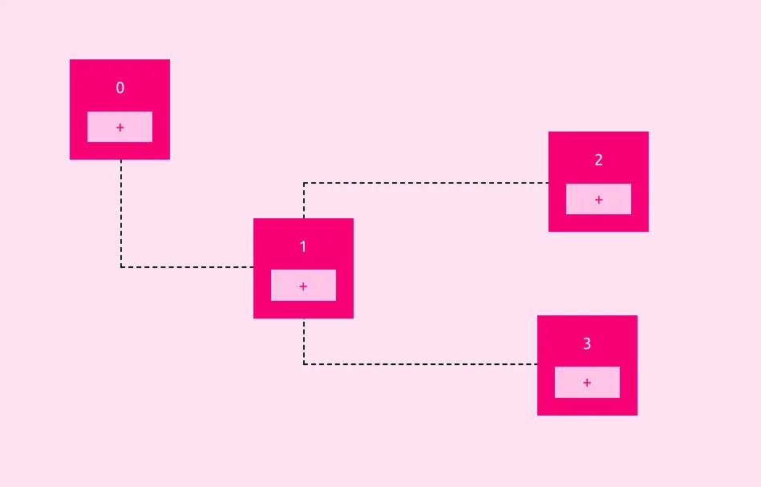

# Fringecore
[Fringecore](https://fringecore.sh/) is a team of engineers and designers, who build software, hack hardware and apply design thinking in-order to tame the chaos in business processes.

## Frontend Questions

<article>

Build a recursive partitioner

[**💻 Problem Repository**](https://github.com/fringecore/fringecore-frontend-challenge-recursive-partitioning)

Show Description

Your task is to create a recursive partitioner. Upon opening the project, users should be greeted with a random background color and two buttons labeled "v" and "h." The "v" button allows the screen to be split vertically, while the "h" button splits it horizontally. When a split occurs, one partition should retain its original color, and the newly created partition should adopt a new random color. Each partition should remain interactive and allow further splits. Additionally, if multiple partitions exist, users should have the option to remove any partition. All partitions should be resizable by clicking and dragging their edges.

</article>

<article>

Build a GPU-accelerated color picker

[**💻 Problem Repository**](https://github.com/fringecore/fringecore-frontend-challenge-colorpicker-pentagon)

Show Description

Develop a GPU-accelerated color picker with a unique pentagon shape, focusing on implementing the core color computation logic using GPU.js, while utilizing the provided React wrapper and UI components. The color picker should generate smooth gradients, handling hue transitions across the color spectrum. Horizontal gradients should transition from white to the primary color, while vertical gradients should range from white to black. 

The implementation must include precise RGB channel calculations based on the current hue, ensure smooth transitions between primary colors, handle the alpha channel correctly, and deliver pixel-perfect gradient rendering. 

Your primary task is to implement the kernelFunction in kernel.js, which will take three parameters—canvas width, canvas height, and the current hue value (0–1)—to compute appropriate RGB values for each pixel, manage color transitions, and return the correct channel value based on the thread position.

</article>

<article>

Build a block graph

[**💻 Problem Repository**](https://github.com/fringecore/fringecore-frontend-challenge-block-graph)

Show Description

Build an interactive page where, upon loading, a block appears at a random position on the screen. Each block should feature a "+" button, which, when pressed, spawns a new block at another random position. All blocks should be draggable using mouse clicks, allowing users to reposition them freely. A dashed line should visually connect each new block to its parent, i.e., the block on which the "+" button was pressed. These connecting lines must dynamically adjust their position to reflect any movement of the parent or child blocks, maintaining their connection at all times.

</article>

<article>

Build a interactive bouncing ball

[**💻 Problem Repository**](https://github.com/fringecore/fringecore-frontend-challenge-bouncing-ball)

Show Description

Create an interactive bouncing ball simulation featuring a ball centered on a blank canvas at the start. 

Display instructions prompting the user to "Click to launch the ball!" Upon clicking, the ball should launch toward the clicked position, bouncing off the canvas boundaries with realistic elastic collisions. Its speed should gradually decrease due to friction, eventually stopping when the speed becomes negligible. At this point, the instructions should reappear, inviting the user to relaunch the ball. Implement core physics features, including constant initial velocity, angle-based directional movement, elastic boundary collisions, and friction-based speed reduction. 

Avoid using any physics or animation libraries, but you may use build tools like Vite or Create React App, and basic styling libraries such as Tailwind.

</article>

<article>

Build an interactive polygon drawing tool

[**💻 Problem Repository**](https://github.com/fringecore/fringecore-frontend-challenge-draw-polygon)

Show Description

Build an interactive polygon drawing tool that features a blank canvas upon project initialization, allowing users to create and edit polygons. Users can define a polygon by clicking points to create vertices and closing the shape by clicking near the starting point. Multiple polygons can be drawn on the same canvas, each created by sequential clicks, with a dashed line previewing the next edge before the polygon is closed. Closed polygons are automatically filled with a semi-transparent color.

The tool should also support editing: vertices are displayed as draggable points, enabling users to modify the shape of the polygons. Multiple polygons can be edited independently without interfering with each other. Smooth dragging functionality must be implemented for seamless vertex adjustments, and overlapping polygons should be handled correctly.

The implementation should use React and SVG for rendering, with React's built-in state management to manage multiple polygons effectively. Focus on writing clean, maintainable code, and use any preferred build tool such as Vite or Create React App. Styling can be enhanced with libraries like Tailwind if needed.

</article>

<article>

Build an interactive art-board

[**💻 Problem Repository**](https://github.com/fringecore/fringecore-frontend-challenge-art-board)

Show Description

Build an interactive art-board featuring a clean white canvas and two tools— a pen tool and an eraser tool—accessible from the top toolbar. When the pen tool is selected, users can draw on the canvas by pressing and holding the mouse button while moving the cursor, creating continuous lines. Releasing the mouse button stops the drawing action.

When the eraser tool is selected, users can erase any drawn lines by pressing and holding the mouse button while moving the cursor over the lines. The eraser should visibly indicate its area of effect, ensuring users can clearly see what will be erased.

The implementation should be lightweight and not rely on external drawing or canvas libraries. You may structure the code in any way you prefer, using build tools like Vite or Create React App, with optional basic styling enhancements via libraries like Tailwind. Focus on creating intuitive functionality for seamless drawing and erasing experiences.

</article>
