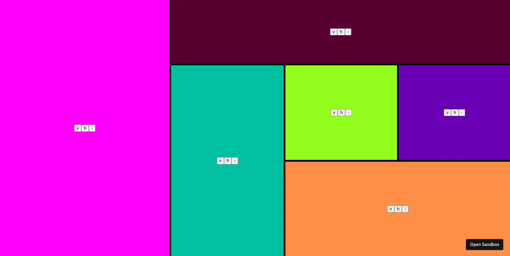
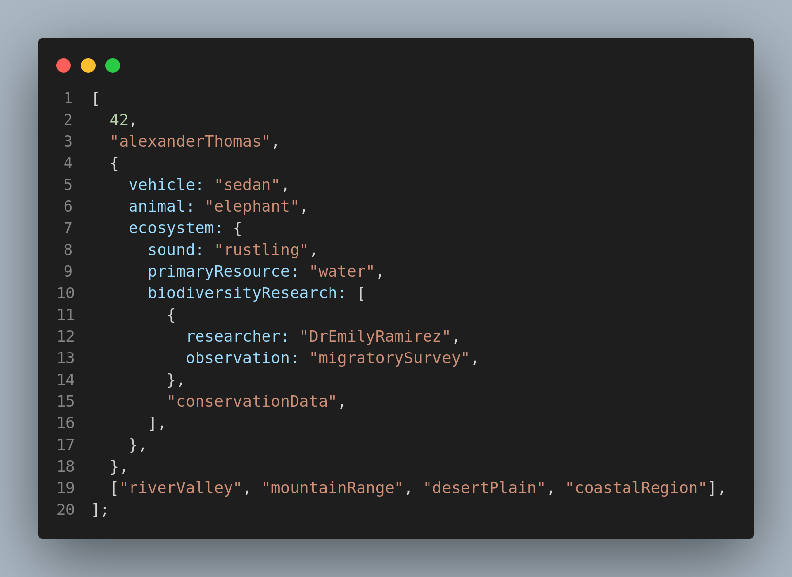
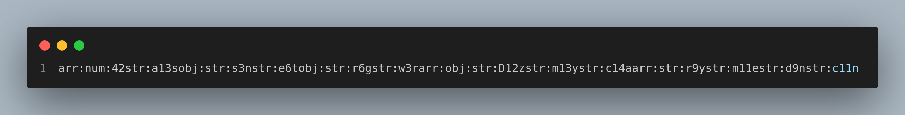
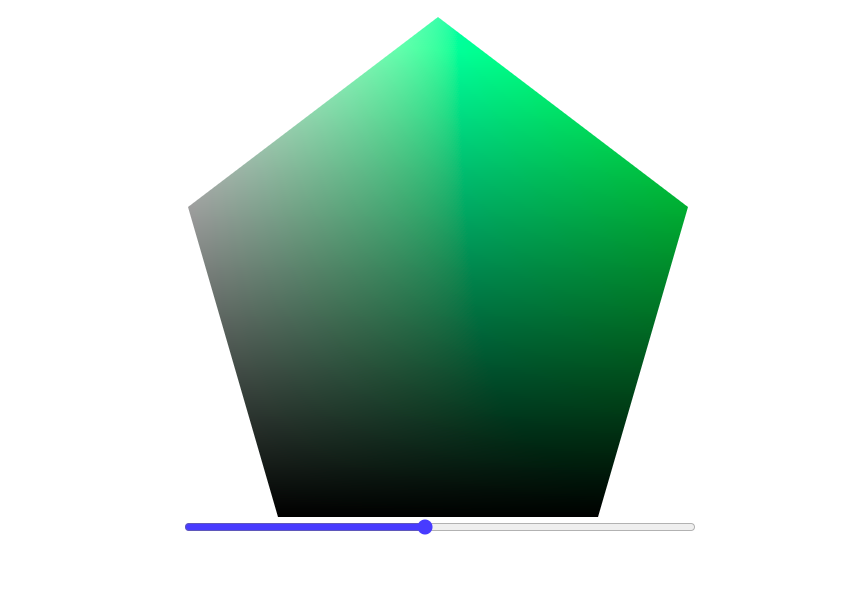

# Fringecore

|  |  |
| :-| :- |
| Founding year | |
| Company Website | https://fringecore.sh/ |
| Career Website | https://work-pool.notion.site/FringeCore_-Careers-cd5106060028424383fcbbb7fc885e38 |
| Technologies Used|  |

## Introduction
[Fringecore](https://fringecore.sh/) is a team of engineers and designers, who build software, hack hardware and apply design thinking in-order to tame the chaos in business processes.

## Frontend Questions

<article>

Build a recursive partitioner

[**💻 Problem Repository**](https://github.com/fringecore/fringecore-frontend-challenge-recursive-partitioning)

Show Description

Your task is to create a recursive partitioner. Upon opening the project, users should be greeted with a random background color and two buttons labeled "v" and "h." The "v" button allows the screen to be split vertically, while the "h" button splits it horizontally. When a split occurs, one partition should retain its original color, and the newly created partition should adopt a new random color. Each partition should remain interactive and allow further splits. Additionally, if multiple partitions exist, users should have the option to remove any partition. All partitions should be resizable by clicking and dragging their edges.

</article>

<article>

Build a GPU-accelerated color picker

[**💻 Problem Repository**](https://github.com/fringecore/fringecore-frontend-challenge-colorpicker-pentagon)

Show Description

Develop a GPU-accelerated color picker with a unique pentagon shape, focusing on implementing the core color computation logic using GPU.js, while utilizing the provided React wrapper and UI components. The color picker should generate smooth gradients, handling hue transitions across the color spectrum. Horizontal gradients should transition from white to the primary color, while vertical gradients should range from white to black. 

The implementation must include precise RGB channel calculations based on the current hue, ensure smooth transitions between primary colors, handle the alpha channel correctly, and deliver pixel-perfect gradient rendering. 

Your primary task is to implement the kernelFunction in kernel.js, which will take three parameters—canvas width, canvas height, and the current hue value (0–1)—to compute appropriate RGB values for each pixel, manage color transitions, and return the correct channel value based on the thread position.

</article>

<article>

Build a block graph

[**💻 Problem Repository**](https://github.com/fringecore/fringecore-frontend-challenge-block-graph)

Show Description

Build an interactive page where, upon loading, a block appears at a random position on the screen. Each block should feature a "+" button, which, when pressed, spawns a new block at another random position. All blocks should be draggable using mouse clicks, allowing users to reposition them freely. A dashed line should visually connect each new block to its parent, i.e., the block on which the "+" button was pressed. These connecting lines must dynamically adjust their position to reflect any movement of the parent or child blocks, maintaining their connection at all times.

</article>

<article>

Build a interactive bouncing ball

[**💻 Problem Repository**](https://github.com/fringecore/fringecore-frontend-challenge-bouncing-ball)

Show Description

Create an interactive bouncing ball simulation featuring a ball centered on a blank canvas at the start. 

Display instructions prompting the user to "Click to launch the ball!" Upon clicking, the ball should launch toward the clicked position, bouncing off the canvas boundaries with realistic elastic collisions. Its speed should gradually decrease due to friction, eventually stopping when the speed becomes negligible. At this point, the instructions should reappear, inviting the user to relaunch the ball. Implement core physics features, including constant initial velocity, angle-based directional movement, elastic boundary collisions, and friction-based speed reduction. 

Avoid using any physics or animation libraries, but you may use build tools like Vite or Create React App, and basic styling libraries such as Tailwind.

</article>

<article>

Build an interactive polygon drawing tool

[**💻 Problem Repository**](https://github.com/fringecore/fringecore-frontend-challenge-draw-polygon)

Show Description

Build an interactive polygon drawing tool that features a blank canvas upon project initialization, allowing users to create and edit polygons. Users can define a polygon by clicking points to create vertices and closing the shape by clicking near the starting point. Multiple polygons can be drawn on the same canvas, each created by sequential clicks, with a dashed line previewing the next edge before the polygon is closed. Closed polygons are automatically filled with a semi-transparent color.

The tool should also support editing: vertices are displayed as draggable points, enabling users to modify the shape of the polygons. Multiple polygons can be edited independently without interfering with each other. Smooth dragging functionality must be implemented for seamless vertex adjustments, and overlapping polygons should be handled correctly.

The implementation should use React and SVG for rendering, with React's built-in state management to manage multiple polygons effectively. Focus on writing clean, maintainable code, and use any preferred build tool such as Vite or Create React App. Styling can be enhanced with libraries like Tailwind if needed.

</article>

<article>

Build an interactive art-board

[**💻 Problem Repository**](https://github.com/fringecore/fringecore-frontend-challenge-art-board)

Show Description

Build an interactive art-board featuring a clean white canvas and two tools— a pen tool and an eraser tool—accessible from the top toolbar. When the pen tool is selected, users can draw on the canvas by pressing and holding the mouse button while moving the cursor, creating continuous lines. Releasing the mouse button stops the drawing action.

When the eraser tool is selected, users can erase any drawn lines by pressing and holding the mouse button while moving the cursor over the lines. The eraser should visibly indicate its area of effect, ensuring users can clearly see what will be erased.

The implementation should be lightweight and not rely on external drawing or canvas libraries. You may structure the code in any way you prefer, using build tools like Vite or Create React App, with optional basic styling enhancements via libraries like Tailwind. Focus on creating intuitive functionality for seamless drawing and erasing experiences.

</article>

## Backend Questions

<article>

Stream Transform

[**💻 Problem Repository**](https://github.com/Abir66/fringecore-backend-challenges/tree/main/stream-transform)

Show Description

There is a TCP server that gives out top secret information mixed with random data. You need to make another server that will connects to this server, reads the streams of text and outputs the same data but with the top-secret data hidden and replaced with dashes.

We don’t really know when the data will end, hence it is absolutely critical that our proxy server that hides secret information does not wait for the entire data before giving output.

</article>

<article>

Custom Serializer

[**💻 Problem Repository**](https://github.com/Abir66/fringecore-backend-challenges/tree/main/custom-serializer)

Show Description

You are given a complex object. You need to write a function that will convert this object into a string with some specific rules.

Sample Input

Sample Output

</article>

<article>

Man in the middle

[**💻 Problem Repository**](https://github.com/Abir66/fringecore-backend-challenges/tree/main/man-in-the-middle)

Show Description

Secure messages exchanged between two individuals, faisal and monjur, were intercepted, but the encryption and protocol used are custom and complex.

***Encryption Details:***

- The encryption keys are `8` bytes long.
- Each message is encrypted with a different key using just `XOR`.
- Messages include the sender's username in lowercase, appended as a prefix with a colon, e.g., `faisal:hello`.
- Messages are padded with newlines (`\n`) to ensure the total length is a multiple of `7` bytes.
- After padding, the message is split into groups of `7` bytes, and an index byte is prepended to each group, turning them into `8-byte` blocks.
- All groups, except the first, are shuffled randomly.
- Each group is then encrypted and `Base64` encoded.
- `faisal` initiates the dialogue.

***What To Build***

1. Write a Node.js program to decrypt and reconstruct the original messages to uncover the content of their communication.
2. Your program should write a file named `decrypted.json` with all the messages in an array.

</article>

<article>

Color Picker Pentagon

[**💻 Problem Repository**](https://github.com/Abir66/fringecore-backend-challenges/tree/main/colorpicker-pentagon)

Show Description

Create a GPU-accelerated color picker with a unique pentagon shape. You'll be implementing the core color computation logic using GPU.js, while we provide the React wrapper and UI components.

1. Core Requirements:
    - Implement a kernel function that generates a color picker gradient
    - Handle hue transitions across the color spectrum
    - Create horizontal gradients from white to the primary color
    - Apply vertical gradients from white to black
2. Color Computation Features:
    - RGB channel calculations based on hue value
    - Smooth transitions between primary colors
    - Proper alpha channel handling
    - Pixel-perfect gradient rendering

**Your Task**

Implement the `kernelFunction` in `kernel.js` that:

1. Takes three parameters:
    - `width`: Canvas width
    - `height`: Canvas height
    - `hue`: Current hue value (0-1)
2. Computes appropriate RGB values for each pixel
3. Handles color transitions and gradients
4. Returns the correct channel value based on the thread position

</article>

<article>

Event Syncer

[**💻 Problem Repository**](https://github.com/Abir66/fringecore-backend-challenges/tree/main/event-syncer)

Show Description

We want to build an awkward mix between a real-time long-polling server and a queue system.

[Video explanation from team Fringecore_](https://www.tella.tv/video/event-syncer-1-416j)

***Event Life-cycle***

1. Events are automatically cleared after 2 minutes
2. Each event is associated with a specific key

***Consumption Mechanism***

1. Each unique combination of `key` and `groupId` represents a distinct consumer group
2. When a consumer group requests events, it will receive ALL unconsumed events for that specific key
3. Once events are consumed by a group, they are marked as consumed and won't be returned again
4. If multiple consumers in the same group request events, only one will receive the available events

***Endpoint Behaviors***

1. `GET /blocking-get?key=meow&groupId=3`:
    - Waits up to 30 seconds for event to be pushed with the key `meow`
    - If there are already unconsumed events for  key `meow` and groupId `3`, return all unconsumed events for that specific key and group
    - Returns an empty array `[]` if no events arrive within 30 seconds
2. `POST /push?key=meow`:
    - Adds new event to the `meow` event queue
    - Does not specify which consumer group will receive the event
    - Multiple events can be pushed under a single key.

</article>

<article>

Priority Task Scheduler

[**💻 Problem Repository**](https://github.com/Abir66/fringecore-backend-challenges/tree/main/priority-task-scheduler)

Show Description

***What To Build***

Modify the function `processTask()` in `challenge.mjs` in such way that:

- **Single Task Processing:** Ensure the program processes only one task at a time.
- **Task Duration:** Each task should be processed for exactly `5` seconds.
- **Priority Handling:**
    - If a new task with **higher priority** arrives while a task is being processed, the program should:
        - Pause the current task.
        - Process the **higher priority** task immediately.
    - Once the higher priority task is completed, the paused task should **resume processing** from where it left off.
- **Task Management:** Maintain a smooth workflow for handling task interruptions and resumptions to ensure no task is lost or delayed indefinitely.

[Video explanation from team Fringecore_](https://www.tella.tv/video/priority-task-scheduler-6lao)

</article>