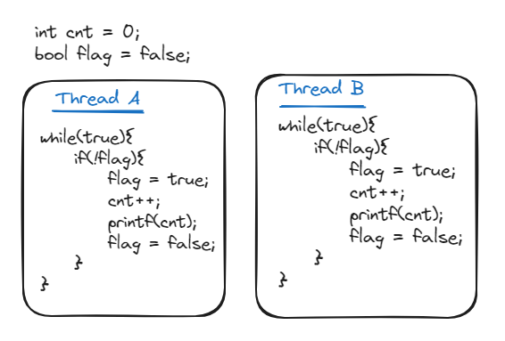

# SRBD

## Introduction
[Samsung R&D Institute Bangladesh (SRBD)](https://research.samsung.com/srbd) started its journey in February 2011. Located in the heart of Dhaka, it is the first ever R&D hub set up by a multinational company in Bangladesh.

> [!TIP]
> SRBD organizes a coding contest every year. The prize money is very handsome. Apart from that, if you do advance to round 2 or 3 means you might get a call for interview skipping the initial screening
## Interview Stages
SRBD takes interview in two round.

1. **Coding round:** Round 1 is coding round. The problems are typically from leetcode. You can only proceed to round 2 if you can solve round 1 correctly.

1. **Technical round:** Round 2 is a technical round. You might get asked about basic theories or solve some simple problems


## Coding Round Questions

<details>
<summary>
You are given n balloons, indexed from 0 to n - 1. Each balloon is painted with a number on it represented by an array nums. You are asked to burst all the balloons.

If you burst the ith balloon, you will get nums[i - 1] * nums[i] * nums[i + 1] coins. If i - 1 or i + 1 goes out of bounds of the array, then treat it as if there is a balloon with a 1 painted on it.

Return the maximum coins you can collect by bursting the balloons wisely.

Variants: coins achived is nums[i-1]*nums[i+1]
</summary>
<hr>
[Answer]
</details>

<details>
<summary>
A linked list of length `n` is given such that each node contains an additional random pointer, which could point to any node in the list, or null. Construct a deep copy of the list.

The deep copy should consist of exactly `n` brand new nodes, where each new node has its value set to the value of its corresponding original node. Both the next and random pointer of the new nodes should point to new nodes in the copied list such that the pointers in the original list and copied list represent the same list state. None of the pointers in the new list should point to nodes in the original list.
</summary>
<hr>
	
```C++
class Solution {
public:
    unordered_map<Node*,Node*> random;
    Node* copyRandomList(Node* head) {
        if( head == NULL ) return NULL;
        Node* node = new Node(head->val);
        random[head] = node;
        node->next = copyRandomList(head->next);
        node->random = random[head->random];
        return node;
    }
};
```
</details>


<details>
<summary> 
Mr. Kim has to deliver refrigerators to `N` customers. From the office, he is going to visit all the customers and then return to his home. 
Each location of the office, his home, and the customers is given in the form of integer coordinates (x,y) (0≤x≤100, 0≤y≤100) . 
The distance between two arbitrary locations (x1, y1) and (x2, y2) is computed by |x1-x2| + |y1-y2|, where |x| denotes the absolute value 
of x; for instance, |3|=|-3|=3. The locations of the office, his home, and the customers are all distinct. You should plan an optimal way 
to visit all the N customers and return to his among all the possibilities. 

You are given the locations of the office, Mr. Kim’s home, and the customers; the number of the customers is in the range of 5 to 10. 

Write a program that, starting at the office, finds a (the) shortest path visiting all the customers and returning to his home. 
Your program only have to report the distance of a (the) shortest path.
</summary>
</details>

<details>
<summary>
You are given a directed graph represented by an adjacency list. Your task is to detect if there exists a cycle in the graph.
If a cycle is found, print the nodes of the cycle in sorted order. Additionally, provide the results for each test case in the format 
"#testCaseNo node1 node2 ... nodeK". If no cycle is present, print 0.
</summary>
<hr>

```C++
#include<bits/stdc++.h>
using namespace std;
int firstNodeOfTheCycle, lastNodeOfTheCycle;
bool detectCycle(int node, vector<vector<int>>& adjList, vector<bool> &visited, vector<bool> &dfsVisited, vector<int> &parent){
    visited[node] = true;
    dfsVisited[node] = true;

    for(auto neighbour : adjList[node]){
        if(!visited[neighbour]){
            parent[neighbour] = node;
            bool isCycleDetected = detectCycle(node, adjList, visited, dfsVisited, parent);
            if(isCycleDetected){
                firstNodeOfTheCycle = neighbour, lastNodeOfTheCycle = node;
                return true;
            }
        }
    }

    dfsVisited[node] = false;
    return false;
}

void calculateCycle(vector<int>& ans, vector<int>& parent){
    int curNode = lastNodeOfTheCycle;
    while(curNode != firstNodeOfTheCycle){
        ans.push_back(curNode);
        curNode = parent[curNode];
    }
    ans.push_back(curNode);
}
int main(){
    int tc = 10;
    for(int t = 1; t < tc; t++){
        int n,m;
        bool wasVisited = false;
        cin >> n >> m;
        vector<vector<int>>& adjList(n + 1);
        vector<bool> visited(n + 1, false), dfsVisited(n + 1, false);
        vector<int> parent(n + 1, -1), ans;
        for(int i = 0; i < m; i++){
            int u, v;
            cin >> u >> v;
            adjList[u].push_back(v);
        }
        for(int i = 1; i <= n; i++){
            if(!visited[i]){
                bool isCycleDetected = detectCycle(i, adjList, visited, dfsVisited, parent);
                if(isCycleDetected){
                    wasVisited = true;
                    calculateCycle(ans, parent);
                    sort(ans.begin(), ans.end());
                    cout<<"#"<<t;
                    for(auto it: ans){
                        cout<<" "<<it;
                    }
                    cout<<endl;
                    break;
                }
            }
        }
        if(!wasVisited){
            cout<<"#"<<t<<" "<<endl;
        }
    }
}
```
</details>


<details>
<summary>
You have string with repeated character. Example : `abcaade`. Count the number of characters that occur more than once. You can’t use array or map. 
</summary>
<hr>
[Answer 1]
My approach : Sort & search concurrent character `nlog(n)`.  

[Answer 2] 
Optimize approach : An integer have 32 bit. We have 26 small letter character.  We just need to allocate each bit for position of a character. If an element is present set the concurrent bit and  finally count the number of set bit.  
(Comment from Tamim: Before trying this approach communicate with the interviewer to make sure about the characters present in the string ie only a-z is present and nothing else)
</details>


## Technical Round Questions
<details>
<summary>
In pen and paper write the inner workings of a BST. How does a BST work? How to insert and retrieve a value from a BST?
</summary>
<hr>
[Answer]
</details>

<details>
<summary>
Thread A and Thread B are running parallely. What will be the output of following code?   


</summary>
<hr>

Unpredictable. It is not guaranteed that which thread is currently accessing the `cnt` variable. Was asked a follow up question on how to solve this issue?


</details>

<details>
<summary>
Given 5 element. We want to search million time that will return if the searched element is present or no. What is the best time complexity.
</summary>
<hr>
[Answer]
You might be tempted to answer using binary search on sorted list but it might be better to use linear search. The internal mechanism for binary search has some constant overhead. For small number that overhead overshadows the benefit of logarithmic complexity. I ran both linear search and binary search. Linear search is about 5 times faster than binary search
</details>

<details>
<summary>
Follow up question. We are guaranteed that each time new search element would be front the next position of previous search. Write code on pen & paper.
</summary>
<hr>
[Answer]

```C++
int lastElementPosition = 0;
int solve( vector<int> arr, int element){
	int l =  0 , r = lastElementPosition;
	while( l <= r){
		int mid = l + (r - l) / 2;
        if( arr[mid] == element ){
            lastElementPosition = mid;
            return mid;
        }
        else if( element < arr[mid] ){
            r = mid - 1;
        }else{
            lastElementPosition = l;
            l = mid + 1;
        }
    }
}
```
</details>

<details>
<summary>
Follow up question. Suppose we have 5000 number each 500 digit. Now how will you search? 
</summary>
<hr>

Trie Data structure
</details>
